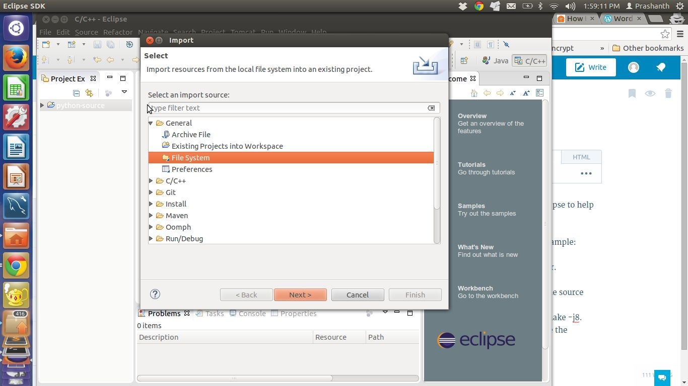
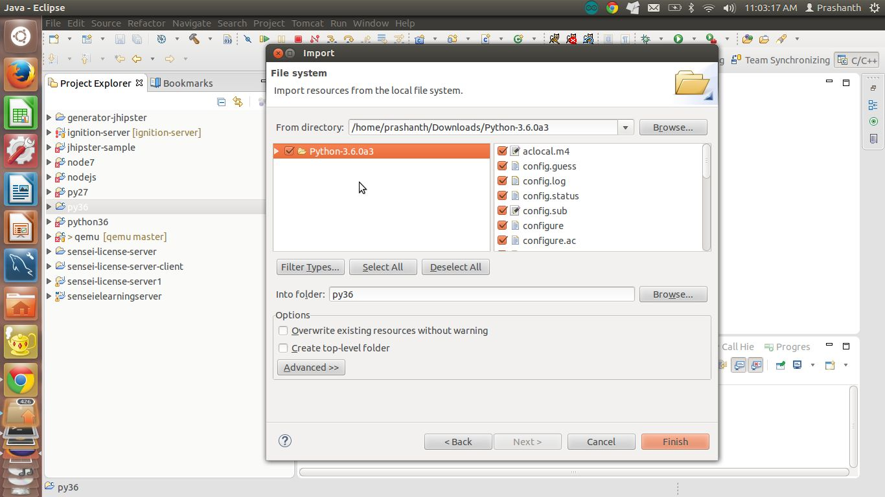
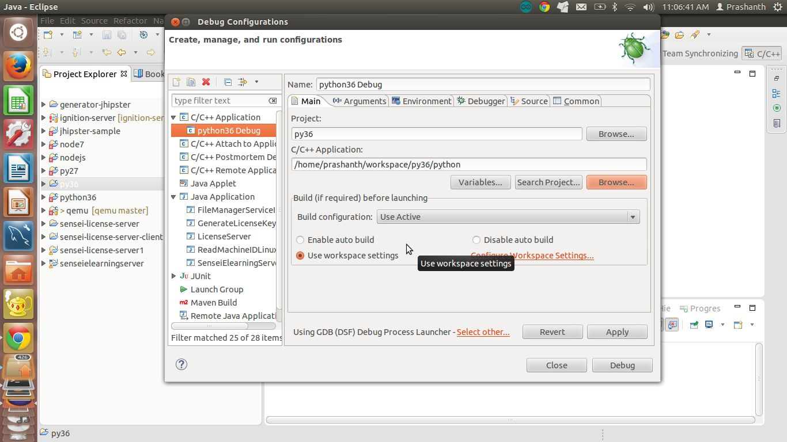
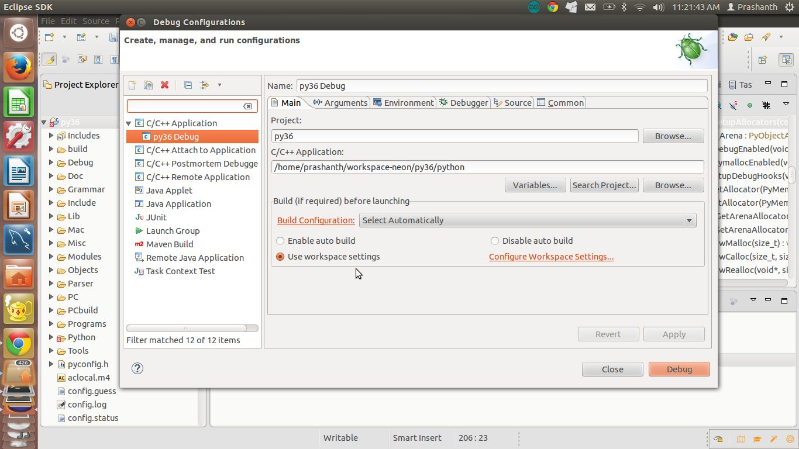

## Chapter​ ​1
## Prerequisites​ and​ setting​ ​up​ the​ environment
## 1.1​ ​Prerequisites

Before​​ we​ set​ out​ to​​ understand​​ the​​ source​ code​ and​ design​ of​ python​ it​ is​ imperative​ that​ we understand the​ setup​ of​ the​ system​ required. Below​ are​ listed​ the​ prerequisites​ that​ are​ required​ to​ setup​ python​ on​ your​ machine.​ If​ you already​ know​ how​ to​ compile​ python​ from​ source​ feel​ ​free​ to​ skip​​ this​ section.

1.​ Linux​​ based ​Operating​ System​ preferably​ Ubuntu​ version​ greater​ ​12.04.​ All​ the experiments were​ based​ on​ ​ubuntu​ 17.04.

2.​ Python​ source​ code

([https://www.python.org/ftp/python/3.6.0/Python-3.6.0.tgz](https://www.python.org/ftp/python/3.6.0/Python-3.6.0.tgz)​)

3.​ ​Eclipse​​ for​​ C/C++

(​[http://www.eclipse.org/downloads/packages/eclipse-ide-cc-developers/neon2](http://www.eclipse.org/downloads/packages/eclipse-ide-cc-developers/neon2))

4.​ gdb

5.​ make

Once​ ​you​ have​​ this​ ​checklist​ ​ready​ ​we​ ​can​ proceed​ ​to​ ​setup​ ​python​ ​for​ ​debugging.

## 1.2​​ ​Setting​ up​ the​ environment

Let​ ​us​ ​examine​ ​the​ ​steps​ for​ ​setting​ up​ ​eclipse​ ​and​ python​ for​ ​debugging.	

	1. Make​ a folder​​ under​​ your​​ home​​ directory​ and​ name​ it​ python-source.

		(Example:​ ​ /home/ubuntu/python-source).

	2. Extract​ the​ ​ contents​ ​ of​ ​ the​ ​ python​ ​ source​ ​ code​ ​ downloaded​ ​ into​ ​ the​ ​ folder using​ ​ the​ ​ command​ ​ $tar​ ​ -xvzf​ ​ 
			<downloaded_python_tar> <folder_to_extract>

	3. Enter​ ​ the​ ​ folder​ ​ in​ ​ the​ ​ command​ ​ line​ ​ using​ ​ the​ ​ command​ ​ $cd python-source.

	4. Type​ ​ the​ ​ command​ ​ $ ​ ​ ./configure​ ​ –with-pydebug​ ​ to​ ​ enable​ ​ debugging​ ​ of the​ ​ source​ ​ code.

	5. When​ ​ the​ ​ command​ ​ completes​ ​ without​ ​errors​ ​enter​ ​the​ ​next​ ​command $make​ ​-j8.​ ​Where​ ​8 ​is​ ​the​ ​number​ ​of​ CPU​ cores.​This​ ​ could​ ​vary​		   on​​ your system.​ ​ Type​ ​ the​ ​ appropriate​ ​ number.

	6. Open​ ​ Eclipse​ ​ and​ ​ create​ ​ a ​ ​ new​ ​ C/C++​ ​ project​ ​ and​ ​ name​ ​ it​ ​ python-source.

	7. Select​ ​ Import​ ​ in​ ​ Eclipse​ ​ menu​ ​ as​ ​ shown​ ​ in​ ​ the​ ​ pictures​ ​ below.

	8. Complete​ ​ the​ ​ wizard​ ​ by​ ​ selecting​ ​ the​ ​ folder​ ​ from​ ​ the​ ​ menu​ ​ and​ ​ the​ ​ project to​ ​ import​ ​ to​ ​ as​ ​ python-source.

	9. Select​ ​ the​ ​ Run​ ​ Menu​ ​ and​ ​ then​ ​ select​ ​ Debug​ ​ Configurations​ ​ to​ ​ open​ ​ the debug​ ​ menu​ ​ as​ ​ shown​ ​ below.

	10.
 

	11. Select​ ​ the​ ​ python​ ​ executable​ ​ as​ ​ shown​ ​ below.

	12. 

	13. Click​ ​ on​ ​ the​ ​ debug​ ​ option​ ​ and​ ​ you​ ​ must​ ​ see​ ​ ​ the​ ​ python​ ​ shell​ ​ in​ ​ the debug​ ​ menu.

You​ ​ are​ ​ ready​ ​ to​ ​ go
