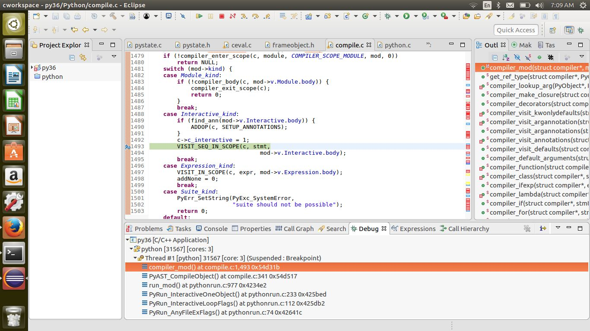
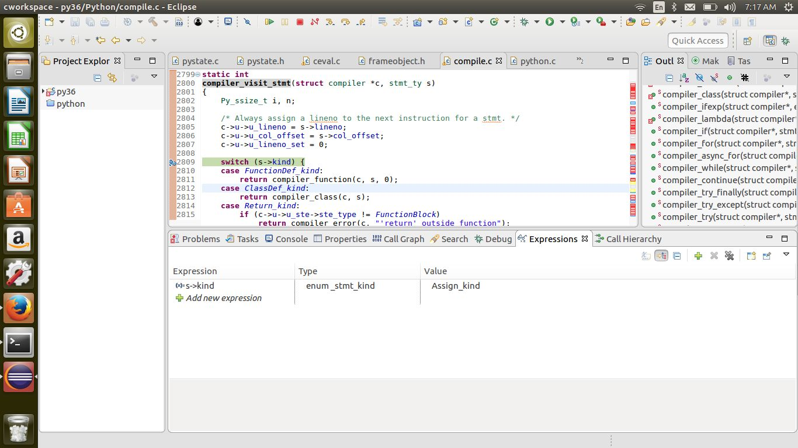
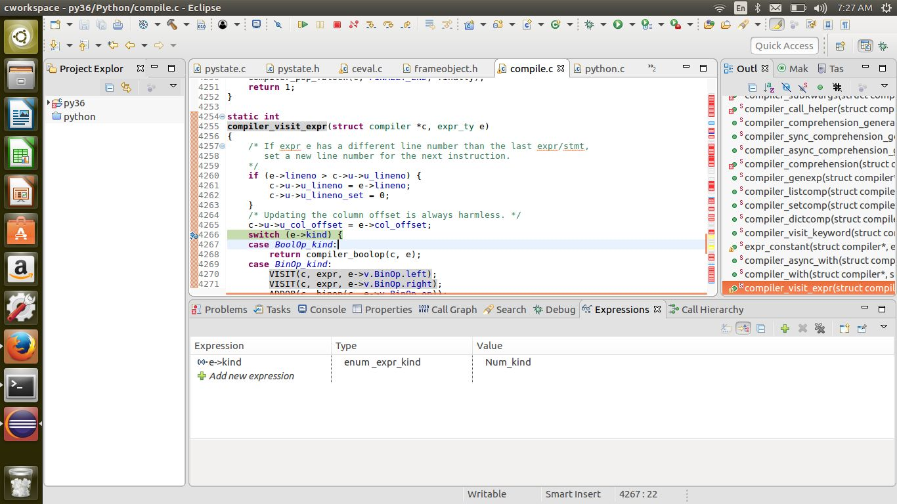
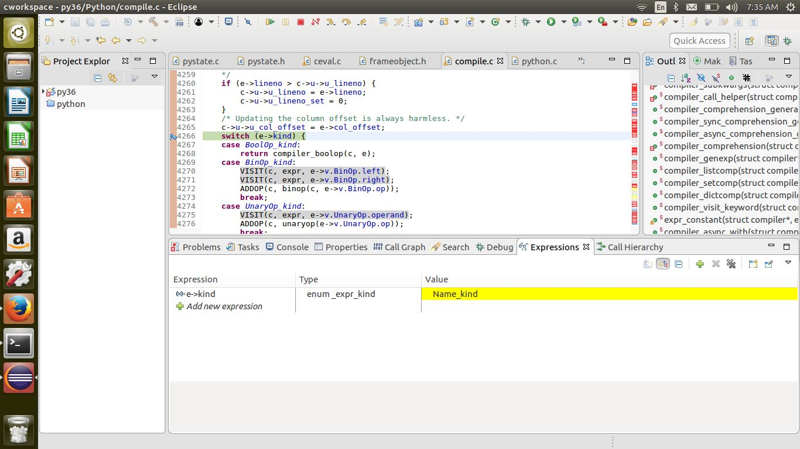

<h1 align="center">  Chapter ​ ​ 6  </h1>

<h2 align="center"> Opcode ​ ​ generation </h2>

Every​ ​executable​ ​instruction​ ​of​ ​the​ ​python​ ​virtual​ ​machine​ ​is​ ​held​ ​by​ ​the​ ​following​ ​instruction
structure.

Listing​ ​5.1​ ​The​ ​instruction​ ​data​ ​structure

```python
struct​​ ​instr​ ​{
​ ​​ ​​ ​​ ​​unsigned​​ ​i_jabs​ ​​:​​ ​​1;
​ ​​ ​​ ​​ ​​unsigned​​ ​i_jrel​ ​​:​​ ​​1;
​ ​​ ​​ ​​ ​​unsigned​​ ​​char​​ ​i_opcode;
​ ​​ ​​ ​​ ​​int​​ ​i_oparg;
​ ​​ ​​ ​​ ​​struct​​ ​basicblock_​ ​​*​i_target​;​​ ​​/*​ ​target​ block​ ​(if​ ​jump​ ​instruction)​ ​*/
​ ​​ ​​ ​​ ​​int​​ ​i_lineno;
};
```
Let​ ​us​ ​understand​ ​the​ ​different​ ​ways​ ​opcodes​ ​are​ ​added​ ​to​ ​the​ ​generated​ ​code​ ​object.

Opcode​ ​generation​ ​for​ ​instructions​ ​without​ ​arguments​ compile.c​ ​line​ ​no​ ​1092.

Listing​​ ​​5.2

Compile.c​ ​line​ ​no​ ​ 1092

```python
static​​ ​​int
compiler_addop​(​struct​​ ​compiler​ ​​*​c​,​​ ​​int​​ ​opcode)
{
​ ​​ ​​ ​​ ​basicblock​ ​​*​b;
​ ​​ ​​ ​​ ​​struct​​ ​instr​ ​​*​i;
​ ​​ ​​ ​​ ​​int​​ ​off;
​ ​​ ​​ ​​ ​​assert​(!​HAS_ARG​(​opcode​));
​ ​​ ​​ ​​ ​off​ ​​=​​ ​compiler_next_instr​(​c​,​​ ​c​-&gt;​u​-&gt;​u_curblock​);
​ ​​ ​​ ​​ ​​if​​ ​​(​off​ ​​&lt;​​ ​​0)
​ ​​ ​​ ​​ ​​ ​​ ​​ ​​ ​​return​​ ​​0;
​ ​​ ​​ ​​ ​b​ ​​=​​ ​c​-&gt;​u​-&gt;​u_curblock;
​ ​​ ​​ ​​ ​i​ ​​=​​ ​​&amp;​b​-&gt;​b_instr​[​off​];
​ ​​ ​​ ​​ ​i​-&gt;​i_opcode​ ​​=​​ ​opcode;
​ ​​ ​​ ​​ ​i​-&gt;​i_oparg​ ​​=​​ ​​ 0 ​;​​ ​​ ​​ ​​//​ ​ 1
​ ​​ ​​ ​​ ​​if​​ ​​(​opcode​ ​​==​​ ​RETURN_VALUE)
​ ​​ ​​ ​​ ​​ ​​ ​​ ​​ ​b​-&gt;​b_return​ ​​=​​ ​​1;
​ ​​ ​​ ​​ ​compiler_set_lineno​(​c​,​​ ​off​);
​ ​​ ​​ ​​ ​​return​​ ​​1;
}
```
Observations:

1. The​​ ​argument​ ​to​ ​the​ ​instruction​ ​​is​​ ​​set​​ ​to​ ​NULL.


Example:

```python
ADDOP​(​c​,​​ ​YIELD_VALUE​);
```
Opcode​​ ​generation​ ​​for​​ ​instructions​ ​​with​​ ​arguments​ ​compile​.​c​ ​line​ ​​no​​ ​​1092.

Listing​​ ​​5.3

Compile.c​ ​line​ ​no​ ​ 1147

```python
static​​ ​​int
compiler_addop_o​(​struct​​ ​compiler​ ​​*​c​,​​ ​​int​​ ​opcode​,​​ PyObject​​ ​​*​dict, ​​PyObject​​ ​​*​o)
{
​ ​​ ​​ ​​ ​​Py_ssize_t​​ ​arg​ ​​=​​ ​compiler_add_o​(​c​,​​ ​dict​,​​ ​o​);
​ ​​ ​​ ​​ ​​if​​ ​​(​arg​ ​​&lt;​​ ​​0)
​ ​​ ​​ ​​ ​​ ​​ ​​ ​​ ​​return​​ ​​0;
​ ​​ ​​ ​​ ​​return​​ ​compiler_addop_i​(​c​,​​ ​opcode​,​​ ​arg​);
}

static​​ ​​Py_ssize_t
compiler_add_o​(​struct​​ ​compiler​ ​​*​c​,​​ ​​PyObject​​ ​​*​dict​,​​
 ​​PyObject​​ ​​*​o)
{
​ ​​ ​​ ​​ ​​PyObject​​ ​​*​t​,​​ ​​*​v;
​ ​​ ​​ ​​ ​​Py_ssize_t​​ ​arg;
​ ​​ ​​ ​​ ​t​ ​​=​​ ​​_PyCode_ConstantKey​(​o​);
​ ​​ ​​ ​​ ​​if​​ ​​(​t​ ​​==​​ ​NULL)
​ ​​ ​​ ​​ ​​ ​​ ​​ ​​ ​​return​​ ​​-​1;
​ ​​ ​​ ​​ ​v​ ​​=​​ ​​PyDict_GetItem​(​dict​,​​ ​t​);
​ ​​ ​​ ​​ ​​if​​ ​​(!​v​)​​ ​{
​ ​​ ​​ ​​ ​​ ​​ ​​ ​​ ​​if​​ ​​(​PyErr_Occurred​())​​ ​{
​ ​​ ​​ ​​ ​​ ​​ ​​ ​​ ​​ ​​ ​​ ​​ ​​Py_DECREF​(​t​);
​ ​​ ​​ ​​ ​​ ​​ ​​ ​​ ​​ ​​ ​​ ​​ ​​return​​ ​​-​1;
​ ​​ ​​ ​​ ​​ ​​ ​​ ​​ ​}
​ ​​ ​​ ​​ ​​ ​​ ​​ ​​ ​arg​ ​​=​​ ​​PyDict_Size​(​dict​);
​ ​​ ​​ ​​ ​​ ​​ ​​ ​​ ​v​ ​​=​​ ​​PyLong_FromSsize_t​(​arg​);​​ ​​ ​​ ​ ​​//​ ​ 1
​ ​​ ​​ ​​ ​​ ​​ ​​ ​​ ​​if​​ ​​(!​v​)​​ ​{
​ ​​ ​​ ​​ ​​ ​​ ​​ ​​ ​​ ​​ ​​ ​​ ​​Py_DECREF​(​t​);
​ ​​ ​​ ​​ ​​ ​​ ​​ ​​ ​​ ​​ ​​ ​​ ​​return​​ ​​-​1;
​ ​​ ​​ ​​ ​​ ​​ ​​ ​​ ​}
​ ​​ ​​ ​​ ​​ ​​ ​​ ​​ ​​if​​ ​​(​PyDict_SetItem​(​dict​,​​ ​t​,​​ ​v​)​​ ​​&lt;​​ ​​ 0 ​)​​ ​{
​ ​​ ​​ ​​ ​​ ​​ ​​ ​​ ​​ ​​ ​​ ​​ ​​Py_DECREF​(​t​);
​ ​​ ​​ ​​ ​​ ​​ ​​ ​​ ​​ ​​ ​​ ​​ ​​Py_DECREF​(​v​);
​ ​​ ​​ ​​ ​​ ​​ ​​ ​​ ​​ ​​ ​​ ​​ ​​return​​ ​​-​1;
 ​ ​​ ​​ ​​ ​​ ​​ ​​ ​​ ​}
​ ​​ ​​ ​​ ​​ ​​ ​​ ​​ ​​Py_DECREF​(​v​);
​ ​​ ​​ ​​ ​}
​ ​​ ​​ ​​ ​​else
​ ​​ ​​ ​​ ​​ ​​ ​​ ​​ ​arg​ ​​=​​ ​​PyLong_AsLong​(​v​);
​ ​​ ​​ ​​ ​​Py_DECREF​(​t​);
​ ​​ ​​ ​​ ​​return​​ ​arg;
}
static​​ ​​int
compiler_addop_i​(​struct​​ ​compiler​ ​​*​c​,​​ ​​int​​ ​opcode​,​​ Py_ssize_t​​ ​oparg)
{
​ ​​ ​​ ​​ ​​struct​​ ​instr​ ​​*​i;
​ ​​ ​​ ​​ ​​int​​ ​off;
​ ​​ ​​ ​​ ​​/*​ ​oparg​ ​value​ ​is​ ​unsigned,​ ​but​ ​a​ ​signed​ ​C​
 ​int​ ​is​ ​usually​ ​used​ ​to​ ​store
​ ​​ ​​ ​​ ​​ ​​ ​​ ​it​ ​​in​​ ​the​ ​C​ ​code​ ​​(​like​ ​​Python​/​ceval​.​c​).
​ ​​ ​​ ​​ ​​ ​​ ​​ ​​Limit​​ ​to​ ​​ 32 ​-​bit​ ​​signed​​ ​C​ ​​int​​ ​​(​rather​ ​than​ ​INT_MAX​)​​ ​​for​​ ​portability.
​ ​​ ​​ ​​ ​​ ​​ ​​ ​​The​​ ​argument​ ​of​ ​a​ ​concrete​ ​bytecode​ ​instruction​ ​​is​​ ​limited​ ​to​ ​​ 8 ​-​bit.
​ ​​ ​​ ​​ ​​ ​​ ​​ ​EXTENDED_ARG​ ​​is​​ ​used​ ​​for​​ ​​ 16 ​,​​ ​​ 24 ​,​​ ​​and​​ ​​ 32 ​-​bit​ ​arguments​.​​ ​​*/
​ ​​ ​​ ​​ ​​assert​(​HAS_ARG​(​opcode​));
​ ​​ ​​ ​​ ​​assert​(​ 0 ​​ ​​&lt;=​​ ​oparg​ ​​&amp;&amp;​​ ​oparg​ ​​&lt;=​​ ​​ 2147483647 ​);
​ ​​ ​​ ​​ ​off​ ​​=​​ ​compiler_next_instr​(​c​,​​ c​-&gt;​u​-&gt;​u_curblock​);
​ ​​ ​​ ​​ ​​if​​ ​​(​off​ ​​&lt;​​ ​​0)
​ ​​ ​​ ​​ ​​ ​​ ​​ ​​ ​​return​​ ​​0;
​ ​​ ​​ ​​ ​i​ ​​=​​ ​​&amp;​c​-&gt;​u​-&gt;​u_curblock​-&gt;​b_instr​[​off​];
​ ​​ ​​ ​​ ​i​-&gt;​i_opcode​ ​​=​​ ​opcode;
​ ​​ ​​ ​​ ​i​-&gt;​i_oparg​ ​​=​​ ​​Py_SAFE_DOWNCAST​(​oparg​,​​ ​​Py_ssize_t​,​​ ​​int​);​​ ​​ ​​//​ ​ 2
​ ​​ ​​ ​​ ​compiler_set_lineno​(​c​,​​ ​off​);
​ ​​ ​​ ​​ ​​return​​ ​​1;
}
```
Observations​ ​from​ ​Listing​ ​5.3

1. The​ ​current​ ​size​ ​is​ ​stored​ ​as​ ​the​ ​value​ ​of​ ​the​ ​dictionary.
2. The​ ​value​ ​is​ ​set​ ​as​ ​the​ ​argument​ ​of​ ​the​ ​instruction.

```python
ADDOP_O​(​c​,​​ ​LOAD_CONST​,​​ ​s​-&gt;​v​.​ClassDef​.​name​,​​ ​consts​);
```
Listing​ ​5.4​ ​Generation​ ​of​ ​opcodes​ ​for​ ​jump​ ​offsets

compile.c​ ​line​ ​no​ ​ 1201&nbsp;


```python
static​​ ​​int
compiler_addop_j​(​struct​​ ​compiler​ ​​*​c​,​​ ​​int​​ ​opcode​,​​ ​basicblock​ ​​*​b​,​​ ​​int
absolute)
{
​ ​​ ​​ ​​ ​​struct​​ ​instr​ ​​*​i;
​ ​​ ​​ ​​ ​​int​​ ​off;
​ ​​ ​​ ​​ ​​assert​(​HAS_ARG​(​opcode​));
​ ​​ ​​ ​​ ​​assert​(​b​ ​​!=​​ ​NULL​);
​ ​​ ​​ ​​ ​off​ ​​=​​ ​compiler_next_instr​(​c​,​​ ​c​-&gt;​u​-&gt;​u_curblock​);
​ ​​ ​​ ​​ ​​if​​ ​​(​off​ ​​&lt;​​ ​​0)
​ ​​ ​​ ​​ ​​ ​​ ​​ ​​ ​​return​​ ​​0;
​ ​​ ​​ ​​ ​i​ ​​=​​ ​​&amp;​c​-&gt;​u​-&gt;​u_curblock​-&gt;​b_instr​[​off​];
​ ​​ ​​ ​​ ​i​-&gt;​i_opcode​ ​​=​​ ​opcode;
​ ​​ ​​ ​​ ​i​-&gt;​i_target​ ​​=​​ ​b​;​​ ​​ ​​ ​​ ​​ ​​ ​​//​ ​ 1
​ ​​ ​​ ​​ ​​if​​ ​​(​absolute)
​ ​​ ​​ ​​ ​​ ​​ ​​ ​​ ​i​-&gt;​i_jabs​ ​​=​​ ​​ 1 ​;​​ ​​ ​​ ​​ ​​//​ ​2
​ ​​ ​​ ​​ ​​else
​ ​​ ​​ ​​ ​​ ​​ ​​ ​​ ​i​-&gt;​i_jrel​ ​​=​​ ​​1;
​ ​​ ​​ ​​ ​compiler_set_lineno​(​c​,​​ ​off​);
​ ​​ ​​ ​​ ​​return​​ ​​1;
}
```
Observations​ ​from​ ​listing​ ​5.4

1. The​ ​target​ ​to​ ​jump​ ​is​ ​set
2. The​ ​flags​ ​to​ ​be​ ​used​ ​at​ ​runtime​ ​whether​ ​the​ ​jump​ ​is​ ​relative​ ​or​ ​absolute​ ​is​ ​set

Example:

Compile.c​ ​line​ ​no​ ​ 2038&nbsp;

```python
static​​ ​​int
compiler_ifexp​(​struct​​ ​compiler​ ​​*​c​,​​ ​expr_ty​ ​e)
{
​ ​​ ​​ ​​ ​basicblock​ ​​*​end​,​​ ​​*​next;
​ ​​ ​​ ​​ ​​assert​(​e​-&gt;​kind​ ​​==​​ ​​IfExp_kind​);
​ ​​ ​​ ​​ ​​end​​ ​​=​​ ​compiler_new_block​(​c​);
​ ​​ ​​ ​​ ​​if​​ ​​(​end​​ ​​==​​ ​NULL)
​ ​​ ​​ ​​ ​​ ​​ ​​ ​​ ​​return​​ ​​0;
​ ​​ ​​ ​​ ​​next​​ ​​=​​ ​compiler_new_block​(​c​);
​ ​​ ​​ ​​ ​​if​​ ​​(​next​​ ​​==​​ ​NULL)
​ ​​ ​​ ​​ ​​ ​​ ​​ ​​ ​​return​​ ​​0;
​ ​​ ​​ ​​ ​VISIT​(​c​,​​ ​expr​,​​ ​e​-&gt;​v​.​IfExp​.​test​);​​ ​​ ​​
 ​​ ​​ ​​ ​​ ​​ ​​//​ ​​ ​​ ​​ ​1.
​ ​​ ​​ ​​ ​ADDOP_JABS​(​c​,​​ ​POP_JUMP_IF_FALSE​,​​ ​​next​);​​ ​​//
​ ​​ ​​ ​​ ​VISIT​(​c​,​​ ​expr​,​​ ​e​-&gt;​v​.​IfExp​.​body​);​​ ​​ ​​ ​​ ​​ ​​ ​​ ​​ ​​//
​ ​​ ​​ ​​ ​ADDOP_JREL​(​c​,​​ ​JUMP_FORWARD​,​​ ​​end​);​​ ​​ ​​ ​​ ​​ ​​ ​​ ​​//​ ​​ ​​ ​​ ​​ ​2.
​ ​​ ​​ ​​ ​compiler_use_next_block​(​c​,​​ ​​next​);​​ ​​ ​​ ​​ ​​ ​​ ​​ ​​//
​ ​​ ​​ ​​ ​VISIT​(​c​,​​ ​expr​,​​ ​e​-&gt;​v​.​IfExp​.​orelse​);​​ ​​ ​​ ​​ ​​ ​​ ​​//​ ​​ ​​ ​​ ​​ ​3.
​ ​​ ​​ ​​ ​compiler_use_next_block​(​c​,​​ ​​end​);​​ ​​ ​​ ​​ ​​ ​​ ​​ ​​ ​​//​ ​​ ​​ ​​ ​​ ​4.
​ ​​ ​​ ​​ ​​return​​ ​​1;
}
```
This​ ​example​ ​clearly​ ​illustrates​ ​the​ ​development​ ​of​ ​a​ if​ ​block​ ​of​ ​code.

1. There​ ​are​ ​ 3 ​ ​blocks​ ​of​ ​code​ ​to​ ​be​ ​used​ ​while​ ​code​ ​generation​ ​of​ ​a​ ​if​ ​statement.
2. The​ ​current​ ​block​ ​which​ ​is​ ​used​ ​to​ ​test​ ​the​ ​condition​ ​which​ ​is​ ​an​ ​extension​ ​of​ ​the
    previous​ ​block​ ​used​ ​by​ ​the​ ​compiler.
3. The​ ​next​ ​block​ ​contains​ ​the​ ​code​ ​for​ ​the​ ​conditions​ ​which​ ​fail​ ​and​ ​hence​ ​an​ ​absolution
    jump​ ​to​ ​the​ ​next​ ​block
4. The​ ​generation​ ​of​ ​the​ ​code​ ​for​ ​the​ ​true​ ​condition​ ​​VISIT​(​c​,​​ ​expr​,​​ ​e​-&gt;​v​.​IfExp​.​body​);
    happens​ ​in​ ​the​ ​current​ ​block.
5. Finally​ ​a​ ​jump​ ​to​ ​the​ ​“end”​ ​block​ ​which​ ​contains​ ​the​ ​other​ ​part​ ​of​ ​the​ ​code.
6. Compile​ ​the​ ​code​ ​for​ ​the​ ​other​ ​else​ ​cases.
7. Finally​ ​pass​ ​the​ ​end​ ​block​ ​for​ ​the​ ​generation​ ​of​ ​the​ ​other​ ​code​ ​for​ ​the​ ​next​ ​code
    generation.

## Topic ​ ​ 5.2 ​ ​ Example ​ ​ of ​ ​ opcode ​ ​ generation

Listing​ ​5.5

Let​ ​us​ ​start​ ​from​ ​a​ ​simple​ ​example​ ​the​ ​rest​ ​of​ ​the​ ​examples​ ​are​ ​available​ ​in​ ​the​ ​respective
chapters.

```python
a​ ​​=​​ ​​ 100
opcode
0 ​​ ​LOAD_CONST 0 ​​ ​​(​100)
2 ​​ ​STORE_NAME 0 ​​ ​​(​a)
```
Debugging​ ​session

Insert​ ​a​ ​breakpoint​ ​on​ ​line​ ​no​ ​ 1493 ​ ​in​ ​the​ ​file​ ​compile.c

```python
​ ​​case​​ ​​Interactive_kind:
if​​ ​​(​find_ann​(​mod​-&gt;​v​.​Interactive​.​body​))​​ ​{
ADDOP​(​c​,​​ ​SETUP_ANNOTATIONS​);
}
c​-&gt;​c_interactive​ ​​=​​ ​​1;
VISIT_SEQ_IN_SCOPE​(​c​,​​ ​stmt,
mod​-&gt;​v​.​Interactive​.​body​);​​ ​​//​ ​ 1
break;

1. The​​ ​value​ ​of​ ​type​ ​​is​​ ​stmt
```


```python
define​​ ​VISIT_SEQ_IN_SCOPE​(​C​,​​ ​TYPE​,​​ ​SEQ​)​​ ​​{​​ ​\
int​​ ​_i​;​​ ​\
asdl_seq​ ​​*​seq​ ​​=​​ ​​(​SEQ​);​​ ​​/*​ ​avoid​ ​variable​ ​capture​
 ​*/​​ ​\
for​​ ​​(​_i​ ​​=​​ ​​ 0 ​;​​ ​_i​ ​​&lt;​​ ​asdl_seq_LEN​(​seq​);​​ ​_i​++)​​ ​​{​​ ​\
TYPE​ ​​##​ ​_ty​ ​elt​ ​=​ ​(TYPE​ ​##​ ​_ty)asdl_seq_GET(seq,​ ​_i);​ ​\
if​​ ​​(!​compiler_visit_​ ​​##​ ​TYPE((C),​ ​elt))​ ​{​ ​\
compiler_exit_scope​(​c​);​​ ​\
return​​ ​​ 0 ​;​​ ​\
}​​ ​\
}​​ ​\
}
```

It​ ​internally​ ​calls​ ​the​ ​function​ ​compiler_visit_stmt​ ​for​ ​element​ ​in​ ​the​ ​asdl_seq​ ​which​ ​is
mod​-&gt;​v​.​Interactive​.​body.

Let​ ​us​ ​insert​ ​a​ ​breakpoint​ ​on​ ​line​ ​no​ ​ 2809&nbsp;

```python
static​​ ​​int
compiler_visit_stmt​(​struct​​ ​compiler​ ​​*​c​,​​ ​stmt_ty​ ​s)
{
Py_ssize_t​​ ​i​,​​ ​n;
/*​ ​Always​ ​assign​ ​a​ ​lineno​ ​to​ ​the​ ​next​ ​instruction​ ​for​
 ​a​ ​stmt.​ ​*/
c​-&gt;​u​-&gt;​u_lineno​ ​​=​​ ​s​-&gt;​lineno;
c​-&gt;​u​-&gt;​u_col_offset​ ​​=​​ ​s​-&gt;​col_offset;
c​-&gt;​u​-&gt;​u_lineno_set​ ​​=​​ ​​0;
switch​​ ​​(​s​-&gt;​kind​)​​ ​{
case​​ ​​FunctionDef_kind:
return​​ ​compiler_function​(​c​,​​ ​s​,​​ ​​ 0 ​);
case​​ ​​ClassDef_kind:
```


Insert​ ​a​ ​breakpoint​ ​on​ ​line​ ​no​ ​ 2830&nbsp;

```python
case​​ ​​Assign_kind:
n​ ​​=​​ ​asdl_seq_LEN​(​s​-&gt;​v​.​Assign​.​targets​);​​ ​​//​ ​ 1
VISIT​(​c​,​​ ​expr​,​​ ​s​-&gt;​v​.​Assign​.​value​);​​ ​​ ​​ ​​ ​​ ​​//​ ​ 2
for​​ ​​(​i​ ​​=​​ ​​ 0 ​;​​ ​i​ ​​&lt;​​ ​n​;​​ ​i​++)​​ ​{
if​​ ​​(​i​ ​​&lt;​​ ​n​ ​​-​​ ​​1)
ADDOP​(​c​,​​ ​DUP_TOP​);​​ ​​ ​​ ​​ ​​ ​​ ​​ ​​ ​​ ​​ ​​ ​​ ​​ ​​ ​​//​​ 3
VISIT​(​c​,​​ ​expr,
(​expr_ty​)​asdl_seq_GET​(​s​-&gt;​v​.​Assign​.​targets​,​​ ​i​));​​ ​​//​ ​ 4
}
break​;
```
1. Value​​ ​of​ ​n​ ​​=​​ ​​ 1 ​​ ​because​ ​the​ ​targets​ ​to​ ​assign​ ​are​ ​just​ ​​ 1 ​​ ​which​ ​​is​​ ​a.
2. We​​ ​shall​ ​see​ ​​in​​ ​the​ ​​next​​ ​section.
3. We​​ ​shall​ ​see​ ​​in​​ ​the​ ​​next​​ ​section.
4. We​​ ​shall​ ​see​ ​​in​​ ​the​ ​​next​​ ​section.

Observation​ ​ 2&nbsp;&nbsp;

Insert​ ​a​ ​breakpoint​ ​on​ ​line​ ​no​ ​ 4266&nbsp;

```python
static​​ ​​int
compiler_visit_expr​(​struct​​ ​compiler​ ​​*​c​,​​ ​expr_ty​ ​e)
{
/*​ ​If​ ​expr​ ​e​ ​has​ ​a​ ​different​ ​line​ ​number​ ​than​ ​the​ ​last​ ​expr/stmt,
set​​ ​a​ ​​new​​ ​line​ ​number​ ​​for​​ ​the​ ​​next​​ ​instruction.
*/
if​​ ​​(​e​-&gt;​lineno​ ​​&gt;​​ ​c​-&gt;​u​-&gt;​u_lineno​)​​ ​{
c​-&gt;​u​-&gt;​u_lineno​ ​​=​​ ​e​-&gt;​lineno;
c​-&gt;​u​-&gt;​u_lineno_set​ ​​=​​ ​​0;
}
/*​ ​Updating​ ​the​ ​column​ ​offset​ ​is​ ​always​ ​harmless.​ ​*/
c​-&gt;​u​-&gt;​u_col_offset​ ​​=​​ ​e​-&gt;​col_offset;
switch​​ ​​(​e​-&gt;​kind​)​​ ​{
```


Insert​ ​a​ ​breakpoint​ ​on​ ​line​ ​no​ ​ 4337&nbsp;

```python
​ ​​case​​ ​​Num_kind:
ADDOP_O​(​c​,​​ ​LOAD_CONST​,​​ ​e​-&gt;​v​.​Num​.​n​,​​ ​consts​);​​ ​​
 ​​//​ ​ 1
break;
```
1. We​​ ​observe​ ​that​ ​LOAD_CONST​ ​​is​​ ​added​ ​​as​​ ​the​ ​opcode

Observation​ ​ 3&nbsp;&nbsp;

```python
TARGET​(​LOAD_CONST​)​​ ​{
PyObject​​ ​​*​value​ ​​=​​ ​GETITEM​(​consts​,​​ ​oparg​);
Py_INCREF​(​value​);
PUSH​(​value​);
FAST_DISPATCH​();
}
TARGET​(​DUP_TOP​)​​ ​{
PyObject​​ ​​*​top​ ​​=​​ ​TOP​();
Py_INCREF​(​top​);
PUSH​(​top​);
FAST_DISPATCH​();
}
The​​ ​top​ ​of​ ​the​ ​stack​ ​which​ ​​is​​ ​the​ ​​last​​ ​constant​ ​​from​​ ​LOAD_CONST​ ​​is​​ ​added​ ​to
the​ ​stack​ ​multiple​ ​times​ ​​as​​ ​many​ ​​as​​ ​the​ ​​no​​ ​of​ ​variable​ ​targets​ ​​in​​ ​the
statement.
```
Observation​ ​ 4&nbsp;&nbsp;

Insert​ ​the​ ​same​ ​breakpoint​ ​on​ ​line​ ​no​ ​ 4266&nbsp;

```python
case​​ ​​Name_kind:
return​​ ​compiler_nameop​(​c​,​​ ​e​-&gt;​v​.​Name​.​id​,​​ ​e​-&gt;​v​.​Name​.​ctx​);
```
Insert​ ​a​ ​breakpoint​ ​on​ ​line​ ​no​ ​ 3141 ​ ​in​ ​the​ ​function​
 ​compiler_nameop

```python
​ ​​assert​(​op​);
arg​ ​​=​​ ​compiler_add_o​(​c​,​​ ​dict​,​​ ​mangled​);
Py_DECREF​(​mangled​);
if​​ ​​(​arg​ ​​&lt;​​ ​​0)
return​​ ​​0;
return​​ ​compiler_addop_i​(​c​,​​ ​op​,​​ ​arg​);
```
We​ ​observe​ ​that​ ​the​ ​value​ ​of​ ​op​ ​is​ ​ 90 ​ ​which​ ​is​ ​the​ ​value​ ​LOAD_CONST.


This​ ​is​ ​as​ ​we​ ​had​ ​seen​ ​at​ ​the​ ​beginning​ ​of​ ​the​ ​topic.

## Topic ​ ​ 5.3 ​ ​ Opcodes ​ ​ of ​ ​ python ​ ​ 3.6

Defined​ ​in​ ​the​ ​file​ ​opcode.h

```python
/*​ ​Auto-generated​ ​by​ ​Tools/scripts/generate_opcode_h.py​ ​*/
#ifndef​​ ​​Py_OPCODE_H
#define​​ ​​Py_OPCODE_H
#ifdef​​ ​__cplusplus
extern​​ ​​"C"​​ ​{
#endif
/*​ ​Instruction​ ​opcodes​ ​for​ ​compiled​ ​code​ ​*/
#define​​ ​POP_TOP 1
#define​​ ​ROT_TWO 2
#define​​ ​ROT_THREE 3
#define​​ ​DUP_TOP 4
#define​​ ​DUP_TOP_TWO 5
#define​​ ​NOP 9
#define​​ ​UNARY_POSITIVE 10
#define​​ ​UNARY_NEGATIVE 11
#define​​ ​UNARY_NOT 12
#define​​ ​UNARY_INVERT 15
#define​​ ​BINARY_MATRIX_MULTIPLY​ ​​ ​​ ​​ 16
#define​​ ​INPLACE_MATRIX_MULTIPLY​ ​​ ​​ 17
#define​​ ​BINARY_POWER 19
#define​​ ​BINARY_MULTIPLY 20
#define​​ ​BINARY_MODULO 22
#define​​ ​BINARY_ADD 23
#define​​ ​BINARY_SUBTRACT 24
#define​​ ​BINARY_SUBSCR 25
#define​​ ​BINARY_FLOOR_DIVIDE 26
#define​​ ​BINARY_TRUE_DIVIDE 27
#define​​ ​INPLACE_FLOOR_DIVIDE 28
#define​​ ​INPLACE_TRUE_DIVIDE 29
#define​​ ​GET_AITER 50
#define​​ ​GET_ANEXT 51
#define​​ ​BEFORE_ASYNC_WITH 52
#define​​ ​INPLACE_ADD 55
#define​​ ​INPLACE_SUBTRACT 56
#define​​ ​INPLACE_MULTIPLY 57
#define​​ ​INPLACE_MODULO 59
#define​​ ​STORE_SUBSCR 60
#define​​ ​DELETE_SUBSCR 61
#define​​ ​BINARY_LSHIFT 62
#define​​ ​BINARY_RSHIFT 63
#define​​ ​BINARY_AND 64
#define​​ ​BINARY_XOR 65
#define​​ ​BINARY_OR 66
#define​​ ​INPLACE_POWER 67
#define​​ ​GET_ITER 68
#define​​ ​GET_YIELD_FROM_ITER 69
#define​​ ​PRINT_EXPR 70
#define​​ ​LOAD_BUILD_CLASS 71
#define​​ ​YIELD_FROM 72
#define​​ ​GET_AWAITABLE 73
#define​​ ​INPLACE_LSHIFT 75
#define​​ ​INPLACE_RSHIFT 76
#define​​ ​INPLACE_AND 77
#define​​ ​INPLACE_XOR 78
#define​​ ​INPLACE_OR 79
#define​​ ​BREAK_LOOP 80
#define​​ ​WITH_CLEANUP_START 81
#define​​ ​WITH_CLEANUP_FINISH 82
#define​​ ​RETURN_VALUE 83
#define​​ ​IMPORT_STAR 84
#define​​ ​SETUP_ANNOTATIONS 85
#define​​ ​YIELD_VALUE 86
#define​​ ​POP_BLOCK 87
#define​​ ​END_FINALLY 88
#define​​ ​POP_EXCEPT 89
#define​​ ​HAVE_ARGUMENT 90
#define​​ ​STORE_NAME 90
#define​​ ​DELETE_NAME 91
#define​​ ​UNPACK_SEQUENCE 92
#define​​ ​FOR_ITER 93
#define​​ ​UNPACK_EX 94
#define​​ ​STORE_ATTR 95
#define​​ ​DELETE_ATTR 96
#define​​ ​STORE_GLOBAL 97
#define​​ ​DELETE_GLOBAL 98
#define​​ ​LOAD_CONST 100
#define​​ ​LOAD_NAME 101
#define​​ ​BUILD_TUPLE 102
#define​​ ​BUILD_LIST 103
#define​​ ​BUILD_SET 104
#define​​ ​BUILD_MAP 105
#define​​ ​LOAD_ATTR 106
#define​​ ​COMPARE_OP 107
#define​​ ​IMPORT_NAME 108
#define​​ ​IMPORT_FROM 109
#define​​ ​JUMP_FORWARD 110
#define​​ ​JUMP_IF_FALSE_OR_POP 111
#define​​ ​JUMP_IF_TRUE_OR_POP 112
#define​​ ​JUMP_ABSOLUTE 113
#define​​ ​POP_JUMP_IF_FALSE 114
#define​​ ​POP_JUMP_IF_TRUE 115
#define​​ ​LOAD_GLOBAL 116
#define​​ ​CONTINUE_LOOP 119
#define​​ ​SETUP_LOOP 120
#define​​ ​SETUP_EXCEPT 121
#define​​ ​SETUP_FINALLY 122
#define​​ ​LOAD_FAST 124
#define​​ ​STORE_FAST 125
#define​​ ​DELETE_FAST 126
#define​​ ​STORE_ANNOTATION 127
#define​​ ​RAISE_VARARGS 130
#define​​ ​CALL_FUNCTION 131
#define​​ ​MAKE_FUNCTION 132
#define​​ ​BUILD_SLICE 133
#define​​ ​LOAD_CLOSURE 135
#define​​ ​LOAD_DEREF 136
#define​​ ​STORE_DEREF 137
#define​​ ​DELETE_DEREF 138
#define​​ ​CALL_FUNCTION_KW 141
#define​​ ​CALL_FUNCTION_EX 142
#define​​ ​SETUP_WITH 143
#define​​ ​EXTENDED_ARG 144
#define​​ ​LIST_APPEND 145
#define​​ ​SET_ADD 146
#define​​ ​MAP_ADD 147
#define​​ ​LOAD_CLASSDEREF 148
#define​​ ​BUILD_LIST_UNPACK 149
#define​​ ​BUILD_MAP_UNPACK 150
#define​​ ​BUILD_MAP_UNPACK_WITH_CALL​ ​​ 151
#define​​ ​BUILD_TUPLE_UNPACK 152
#define​​ ​BUILD_SET_UNPACK 153
#define​​ ​SETUP_ASYNC_WITH 154
#define​​ ​FORMAT_VALUE 155
#define​​ ​BUILD_CONST_KEY_MAP 156
#define​​ ​BUILD_STRING 157
#define​​ ​BUILD_TUPLE_UNPACK_WITH_CALL​ ​​ 158


/*​ ​EXCEPT_HANDLER​ ​is​ ​a​ ​special,​ ​implicit​ ​block​ ​type​ ​which​ ​is​ ​created​ ​when
​ ​​ ​​ ​entering​ ​an​ ​​except​​ ​handler​.​​ ​​It​​ ​​is​​ ​​not​​ ​an​ ​opcode​ ​but​ ​we​ ​define​ ​it​ ​here
​ ​​ ​​ ​​as​​ ​we​ ​want​ ​it​ ​to​ ​be​ ​available​ ​to​ ​both​ ​frameobject​.​c​ ​​and​​ ​ceval​.​c​,​​ ​​while
​ ​​ ​​ ​remaining​ ​​private​.*/
#define​​ ​EXCEPT_HANDLER​ ​​ 257


enum​​ ​cmp_op​ ​​{​PyCmp_LT​=​Py_LT​,​​ ​​PyCmp_LE​=​Py_LE​,​​ ​​PyCmp_EQ​=​Py_EQ​, PyCmp_NE​=​Py_NE, PyCmp_GT​=​Py_GT​,​​ ​​PyCmp_GE​=​Py_GE​,​​ ​​PyCmp_IN​,​​ ​​PyCmp_NOT_IN, PyCmp_IS​,​​ ​​PyCmp_IS_NOT​, PyCmp_EXC_MATCH​,​​ ​​PyCmp_BAD​};
#define​​ ​HAS_ARG​(​op​)​​ ​​((​op​)​​ ​​&gt;=​​ ​HAVE_ARGUMENT)
#ifdef​​ ​__cplusplus
}
#endif
#endif​​ ​​/*​ ​!Py_OPCODE_H​ ​*/
```
We​ ​shall​ ​understand​ ​the​ ​implementation​ ​of​ ​these​ ​opcodes​ ​in​ ​the​ ​coming​ ​chapters.
